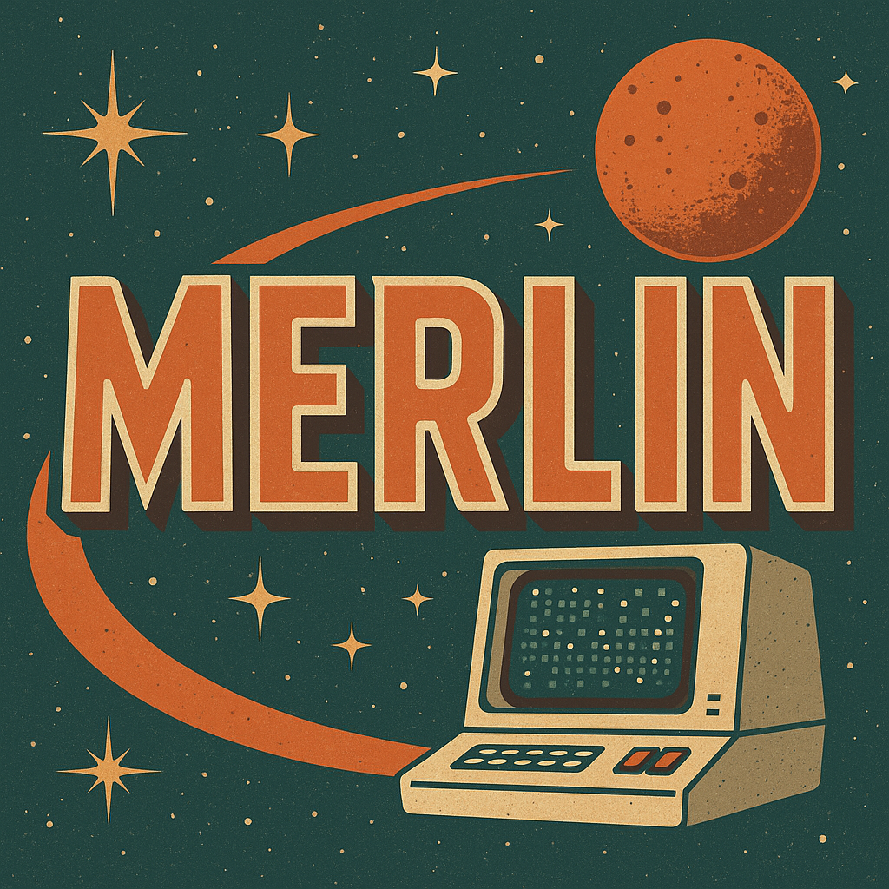

# dissertation-dsl-grammar

Langium grammar project for the DSL that I am building as part of my doctoral research. Codenamed MERLIN, which is a nod to H. Beam Piper's novel *The Cosmic Computer*.

I'm still currently laying the groundwork so that I can plan the construction of this grammar. More to come!

```
  "MarkEt monitoRing Language for surveIllaNce" -- MERLIN!, 
```



```
*Logo co-designed using GPT-4-turbo (OpenAI), via ChatGPT, April 2025.*
```
## Author

Please see [ericgrasby.xyz](https://ericgrasby.xyz/academic) for the author's academic credentials. The author's GitHub can be found [here - echarlesgrasby](https://github.com/echarlesgrasby).

## News Updates

### Fall 2025 Milestones

Project milestones for the Fall 2025 semester include:

1. Complete Delphi Study round #2
    1. - [ ] Round #2 officially **closes on 10/10/2025**
3. Write and distribute round #2 whitepaper to panel participants
4. Synthesize functional requirements document from Delphi Study results
5. Complete (and pass!) dissertation proposal defense in September 2025
    1. - [X] Passed on September 30, 2025 with a unanimous "move forward" vote from my committee
6. Write and complete chapter 3 of dissertation (requirements modeling and analysis)
7. Start gathering test data for prototype


### 2025-08-04

I am working on completing the proposal document (essentially the first 2 chapters of my dissertation) in order to perform my proposal defense this fall. Once the proposal is complete, I can break ground on the actual prototype application. 
In the meantime, I have been working on completing a Delphi study with a group of experts that match the ideal user persona for this kind of system. I anticipate that this semester (Fall 2025) will include completion of the milestones listed above (Fall 2025 Milestones)

### 2025-10-03

As you'll see in the checklist, I officially completed my dissertation proposal defense on 09.30.2025! That was a huge feeling of accomplishment for me. I talked for probably 40 minutes straight (have not done that in quite a while!). My next stop is to close out the Delphi study at the end of next week and start processing all of the results into proper software requirements. More to come later this month!

